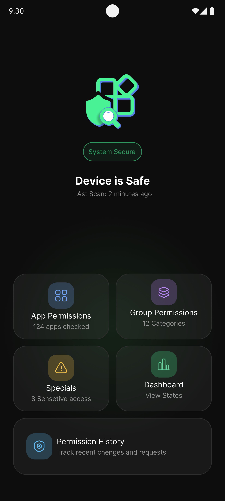
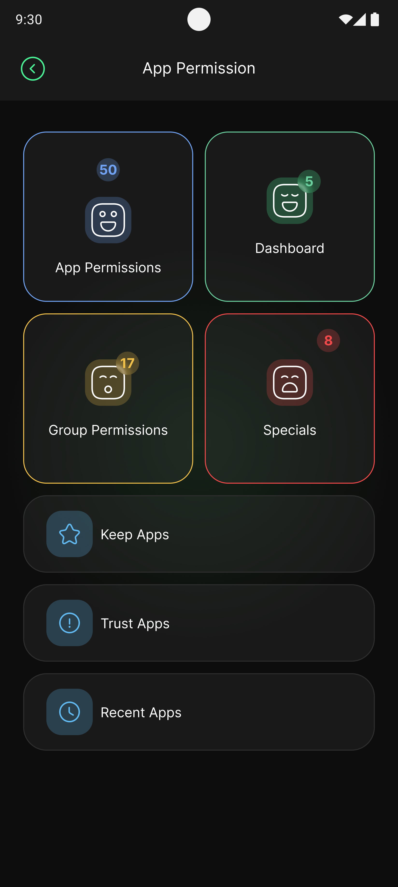
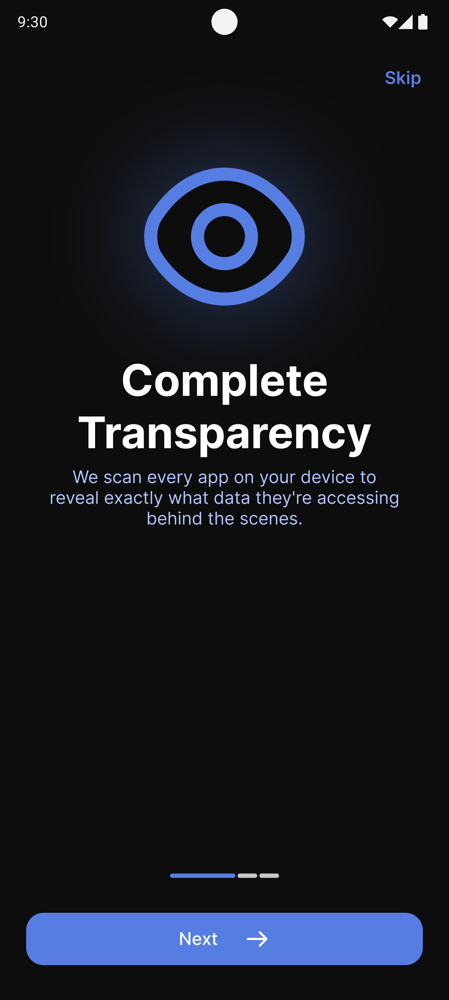
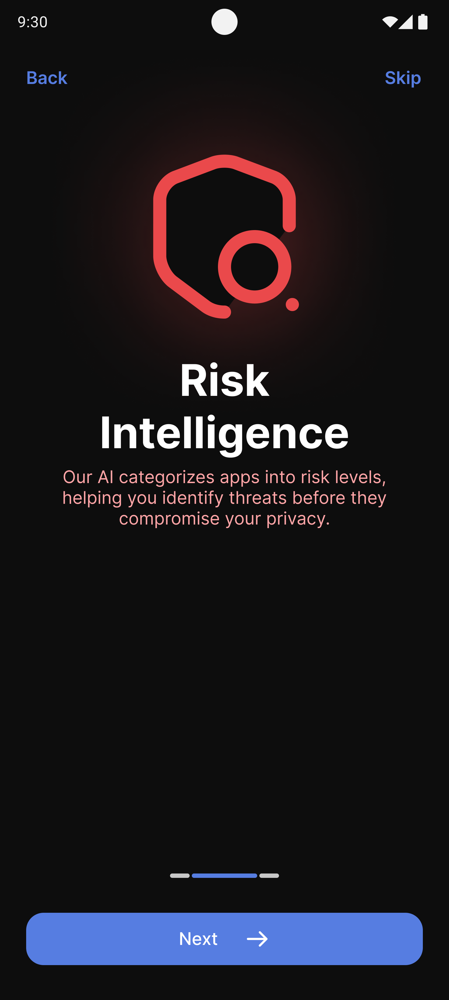
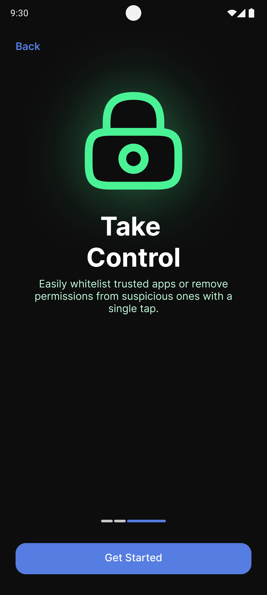

# 🔒 Permission App

A powerful Android privacy guardian built with Flutter that scans all installed apps, analyzes their permissions, and helps you take control of your device's security.

---

## 📱 Screenshots

<p align="center">
  
  
  
</p>

<p align="center">
  
  
</p>

---

## ✨ Features

- 🔍 **App Permissions** — Scan all installed apps and view their requested permissions
- 📊 **Dashboard** — Get a full privacy overview of your device status
- 🗂️ **Group Permissions** — Browse permissions by category (Camera, Location, Contacts...)
- ⚠️ **Special Permissions** — Detect sensitive access like Display Over Apps, Notification Access, Battery Optimization, and more
- 🛡️ **Risk Intelligence** — Automatically categorize apps by risk level (Safe / Medium / High)
- ⭐ **Keep Apps** — Whitelist trusted apps you want to keep monitored
- ✅ **Trust Apps** — Mark apps you fully trust
- 🕐 **Recent Apps** — Track recently used apps and their permission activity
- 🌍 **Multi-language** — Supports Persian (فارسی) and English

---

## 🛠️ Tech Stack

| Category | Technology |
|---|---|
| Framework | Flutter |
| Language | Dart |
| State Management | Bloc / Cubit |
| Local Database | Hive |
| Routing | GoRouter with ShellRoute |
| Architecture | Feature-first Clean Architecture |

---

## 📁 Project Structure

```
lib/
├── constant/         # Colors, styles, permission constants
├── core/
│   ├── models/       # Data models
│   ├── services/     # Business logic & platform services
│   └── utils/        # Helper utilities
├── logic/            # Cubits & state management
│   ├── app_permission/
│   ├── risk/
│   └── special_permission/
├── presentation/     # UI screens & widgets
│   ├── home/
│   ├── dashboard/
│   ├── apps_permission/
│   ├── group_permission/
│   ├── special_permissions/
│   └── onboarding/
└── routs/            # App routing
```

---

## 🚀 Getting Started

### Prerequisites
- Flutter SDK >= 3.0.0
- Android SDK
- Android device or emulator (API 21+)

### Installation

```bash
# Clone the repository
git clone https://github.com/tinaamini/permission-app.git

# Navigate to project directory
cd permission-app

# Install dependencies
flutter pub get

# Run the app
flutter run
```

---

## 📋 Permissions Required

This app requires the following permissions to function:

- `QUERY_ALL_PACKAGES` — To scan installed apps
- `PACKAGE_USAGE_STATS` — To track recent app activity

---

## 👩‍💻 Author

**Tina Amini** — Flutter Developer

[](https://www.linkedin.com/in/tina-amini)
[](https://github.com/tinaamini)

---

## 📄 License

This project is licensed under the MIT License.
